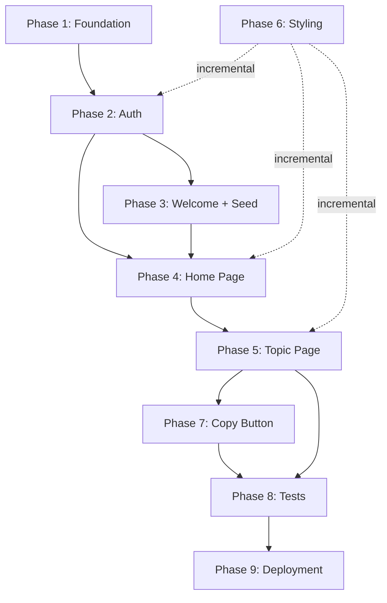

# Developer Notebook -- Implementation Plan

## Context

The project is fully designed and scaffolded. All files exist but are empty (0 bytes), except `app/__init__.py` (hello-world placeholder). Dependencies are already declared in [`pyproject.toml`](pyproject.toml) and locked in `uv.lock`. The complete design lives in [`cursor_chats/project-design.md`](cursor_chats/project-design.md).

The source Word file [`Developer_Commands.docx`](Developer_Commands.docx) contains the seed content -- ~18 topics of developer commands organized as two-column tables (description + command).

---

## Phase 1: Foundation (Database + Models + App Shell)

Build the core infrastructure that everything else depends on.

### 1a. Database setup -- [`app/database.py`](app/database.py)

- SQLAlchemy engine pointed at a local SQLite file (e.g. `notebook.db`)
- `SessionLocal` factory and `Base` declarative base
- `get_db` dependency for FastAPI route injection

### 1b. Models -- [`app/models.py`](app/models.py)

Four models with this ownership chain: **User -> Topic -> Section -> Entry**

- `User`: id, username (unique), password_hash
- `Topic`: id, user_id (FK), name, slug (unique per user, auto-generated), display_order
- `Section`: id, topic_id (FK), name (nullable -- null means default section), display_order, notes (nullable)
- `Entry`: id, section_id (FK), description, command, display_order

Cascade deletes: deleting a Topic cascades to its Sections and Entries; deleting a Section cascades to its Entries.

All four model classes get NumPy-style docstrings documenting their purpose and attributes:

```python
class Topic(Base):
    """A named collection of developer command sections.

    Attributes
    ----------
    id : int
        Primary key.
    user_id : int
        Foreign key to the owning User.
    name : str
        Display name of the topic (e.g. "Git").
    slug : str
        URL-safe identifier, auto-generated from name. Unique per user.
    display_order : int
        Position in the user's topic list.
    """
```

### 1c. App entry point -- [`app/main.py`](app/main.py)

- Create the FastAPI app
- Mount static files at `/static`
- Configure Jinja2 templates
- Create tables on startup (`Base.metadata.create_all`)
- Include route routers (added incrementally in later phases)
- Configure application logging using Python's `logging` module:

```python
import logging
import os

logging.basicConfig(
    level=getattr(logging, os.environ.get("LOG_LEVEL", "INFO").upper(), logging.INFO),
    format="%(asctime)s  %(levelname)-8s  %(name)s  %(message)s",
)
logger = logging.getLogger("devnotebook")
```

The log level defaults to `INFO` in production but can be switched to `DEBUG` during development by setting an environment variable:

```bash
LOG_LEVEL=DEBUG uvicorn app.main:app --reload
```

Each module that needs logging imports its own logger via `logger = logging.getLogger("devnotebook.<module>")`. Key events to log throughout Phases 2-5:

- **Auth** (`devnotebook.auth`): user registered, login succeeded, login failed (bad password / unknown user), logout
- **Topics** (`devnotebook.routes.topics`): topic created, renamed, deleted, reordered
- **Sections** (`devnotebook.routes.sections`): section created, renamed, deleted, reordered
- **Entries** (`devnotebook.routes.entries`): entry created, updated, deleted, reordered
- **Seed** (`devnotebook.services.seed`): starter data populated for user, with counts
- **Errors**: log at `WARNING` or `ERROR` level for ownership violations, missing resources, and unexpected exceptions

At the end of Phase 1, the app should start with `uvicorn app.main:app --reload` without errors.

---

## Phase 2: Authentication

### 2a. Auth utilities -- [`app/auth.py`](app/auth.py)

All functions in this module get NumPy-style docstrings (parameters, returns, raises).

- `hash_password(password)` and `verify_password(password, hash)` using bcrypt
- `create_session(response, user_id)` -- signs user_id with `itsdangerous.URLSafeSerializer` and sets a session cookie
- `get_current_user(request, db)` -- reads the session cookie, deserializes, looks up the User. Returns `None` if invalid.
- `require_auth` -- a FastAPI dependency that calls `get_current_user` and redirects to `/login` if not authenticated

### 2b. Auth pages -- [`app/routes/pages.py`](app/routes/pages.py) (partial, auth-related routes only)

Every route handler across all route files gets a NumPy-style docstring describing the endpoint, its parameters, and what it returns. Example:

```python
@router.post("/login")
async def login(request: Request, db: Session = Depends(get_db)):
    """Authenticate a user and establish a session.

    Parameters
    ----------
    request : Request
        The incoming request containing form data with
        ``username`` and ``password`` fields.
    db : Session
        Database session provided by dependency injection.

    Returns
    -------
    RedirectResponse
        Redirects to ``/`` on success, or back to ``/login``
        with an error message on failure.
    """
```

- `GET /login` -- render [`templates/login.html`](app/templates/login.html)
- `POST /login` -- validate credentials, set session cookie, redirect to `/`
- `GET /register` -- render [`templates/register.html`](app/templates/register.html)
- `POST /register` -- create user, set session cookie, redirect to `/welcome`
- `POST /logout` -- clear session cookie, redirect to `/login`

### 2c. Auth templates

- [`templates/base.html`](app/templates/base.html) -- HTML skeleton with nav bar (username + logout), HTMX and SortableJS CDN script tags, link to `styles.css`, `` placeholder
- [`templates/login.html`](app/templates/login.html) -- centered username/password form, link to register
- [`templates/register.html`](app/templates/register.html) -- centered username/password form, link to login

At the end of Phase 2, a user can register, log in, log out, and is redirected to login when unauthenticated.

---

## Phase 3: Welcome + Seed Data

### 3a. Seed data -- [`app/seed_data.py`](app/seed_data.py)

- Parse or manually transcribe `Developer_Commands.docx` into a Python list-of-dicts structure:

```python
STARTER_DATA = [
    {
        "name": "Git",
        "sections": [
            {
                "name": "Branches",
                "entries": [
                    {"description": "delete a local branch", "command": "git branch -d <branch name>"},
                    ...
                ]
            },
            ...
        ]
    },
    {"name": "Flask", "sections": [{"name": None, "entries": [...]}]},
    ...
]
```

Topics with no meaningful subdivisions (Flask, MongoDB, etc.) get a single section with `name = None`.

### 3b. Seed service -- [`app/services/seed.py`](app/services/seed.py)

- `populate_starter_data(db, user_id)` -- iterates `STARTER_DATA`, creates Topic/Section/Entry records linked to the given user, assigns sequential `display_order` values, auto-generates slugs

### 3c. Welcome page

- [`templates/welcome.html`](app/templates/welcome.html) -- two cards: "Start with Developer Commands template" and "Start with a blank notebook"
- `GET /welcome` and `POST /welcome` routes in [`app/routes/pages.py`](app/routes/pages.py) -- if user chooses template, call `populate_starter_data`; redirect to `/`

---

## Phase 4: Home Page (Topic Cards)

### 4a. Home page route -- [`app/routes/pages.py`](app/routes/pages.py)

- `GET /` -- query all Topics for the current user (ordered by `display_order`), render [`templates/home.html`](app/templates/home.html)

### 4b. Topic CRUD routes -- [`app/routes/topics.py`](app/routes/topics.py)

- `POST /topics` -- create topic + default unnamed section, return rendered `topic_card.html` partial
- `GET /topics/{id}/edit` -- return inline edit form partial
- `PUT /topics/{id}` -- rename topic, update slug, return updated `topic_card.html`
- `DELETE /topics/{id}` -- cascade delete, return empty string
- `PUT /topics/reorder` -- accept ordered list of IDs, update `display_order` values

### 4c. Templates

- [`templates/home.html`](app/templates/home.html) -- extends `base.html`, renders a grid of topic cards with a "+ Topic" button, SortableJS initialization
- [`templates/partials/topic_card.html`](app/templates/partials/topic_card.html) -- single card showing topic name, section count, edit/delete controls
- [`templates/partials/add_form.html`](app/templates/partials/add_form.html) -- reusable inline form (used for adding topics, sections, and entries)

---

## Phase 5: Topic Page (Sections + Entries)

This is the largest phase -- the core content editing experience.

### 5a. Topic page route -- [`app/routes/pages.py`](app/routes/pages.py)

- `GET /topic/{slug}` -- load Topic with all Sections and Entries (eager-loaded), verify ownership, render [`templates/topic.html`](app/templates/topic.html)

### 5b. Section CRUD routes -- [`app/routes/sections.py`](app/routes/sections.py)

- `POST /topics/{topic_id}/sections` -- create named section, return rendered `section.html` partial
- `GET /sections/{id}/edit` -- return inline edit form
- `PUT /sections/{id}` -- rename section, return updated section header
- `DELETE /sections/{id}` -- cascade delete entries, return empty string
- `PUT /sections/reorder` -- accept ordered list of IDs, update `display_order`

### 5c. Entry CRUD routes -- [`app/routes/entries.py`](app/routes/entries.py)

- `POST /sections/{section_id}/entries` -- create entry, return rendered `entry_row.html` partial
- `GET /entries/{id}/edit` -- return [`entry_edit.html`](app/templates/partials/entry_edit.html) inline form
- `PUT /entries/{id}` -- save edit, return updated `entry_row.html`
- `DELETE /entries/{id}` -- return empty string
- `PUT /entries/reorder` -- accept ordered list of IDs, update `display_order`

### 5d. Templates

- [`templates/topic.html`](app/templates/topic.html) -- extends `base.html`, back link, topic heading, conditional section sidebar (shown only when multiple named sections exist), sections with entry tables, "+ Add Section" / "+ Add Entry" buttons, SortableJS initialization for sections and entries
- [`templates/partials/section.html`](app/templates/partials/section.html) -- section heading (with optional notes/warning callout), two-column entry table, "+ Add Entry" button
- [`templates/partials/entry_row.html`](app/templates/partials/entry_row.html) -- table row with description, command, copy button `[copy]`, edit/delete controls
- [`templates/partials/entry_edit.html`](app/templates/partials/entry_edit.html) -- table row with input fields for description and command, save/cancel buttons

---

## Phase 6: Styling

### [`app/static/styles.css`](app/static/styles.css)

- CSS custom properties for colors, spacing, border-radius (design tokens defined in the design doc)
- Base/reset styles
- Layout: nav bar, centered content container, CSS grid for topic cards
- Component styles: cards, tables, forms, buttons, section sidebar, copy button, callout/warning blocks
- Interactive states: hover, focus, drag-and-drop visual feedback
- Responsive breakpoints for mobile/tablet

This can be developed incrementally alongside Phases 2-5 -- basic layout first, polish later.

---

## Phase 7: Copy-to-Clipboard

- Small inline `<script>` or JS function in `base.html` for the copy button behavior (reads the command text, calls `navigator.clipboard.writeText()`, provides visual feedback like a brief "Copied!" tooltip)
- Wire the copy button in `entry_row.html`

---

## Phase 8: Automated Test Suite

### 8a. Dependencies and setup

- Add `pytest` and `httpx` as dev dependencies (`uv add --dev pytest httpx`)
- Create `tests/` directory with `conftest.py`

### 8b. Test fixtures -- `tests/conftest.py`

- **`test_db`** -- creates a fresh in-memory SQLite database (`sqlite:///:memory:`), runs `Base.metadata.create_all`, yields a session, then tears down. Each test gets an isolated database.
- **`client`** -- creates a FastAPI `TestClient` (via `httpx.ASGITransport`) with the `get_db` dependency overridden to use the `test_db` fixture
- **`authenticated_client`** -- registers a test user, logs in, and returns a client with the session cookie set. Most tests will use this.
- **`seeded_client`** -- an authenticated client whose user has been populated with starter data via `populate_starter_data`

### 8c. Model tests -- `tests/test_models.py`

- Create each model type and verify fields persist correctly
- Verify the User -> Topic -> Section -> Entry ownership chain
- Verify cascade deletes: deleting a Topic removes its Sections and Entries; deleting a Section removes its Entries
- Verify slug auto-generation and uniqueness constraints
- Verify that `Section.name` can be null (default section behavior)

### 8d. Auth tests -- `tests/test_auth.py`

- `POST /register` creates a new user and redirects to `/welcome`
- `POST /register` with a duplicate username returns an error
- `POST /login` with valid credentials sets a session cookie and redirects to `/`
- `POST /login` with invalid credentials returns an error
- `POST /logout` clears the session and redirects to `/login`
- Unauthenticated requests to protected routes (`/`, `/topic/git`) redirect to `/login`
- `hash_password` / `verify_password` round-trip correctly

### 8e. Seed tests -- `tests/test_seed.py`

- `populate_starter_data` creates the expected number of topics, sections, and entries for a user
- Each seeded topic has a valid slug and sequential display_order
- Topics with no subdivisions have a single section with `name = None`
- Seeding for one user does not affect another user's data

### 8f. Topic CRUD tests -- `tests/test_topics.py`

- `POST /topics` creates a topic with a default unnamed section and returns a topic card partial
- `PUT /topics/{id}` renames a topic and updates its slug
- `DELETE /topics/{id}` removes the topic and all its sections/entries
- `PUT /topics/reorder` updates display_order values
- A user cannot access or modify another user's topics (ownership check)

### 8g. Section CRUD tests -- `tests/test_sections.py`

- `POST /topics/{id}/sections` creates a named section
- `PUT /sections/{id}` renames a section
- `DELETE /sections/{id}` removes the section and its entries
- `PUT /sections/reorder` updates display_order values
- Ownership enforcement across the Topic -> Section chain

### 8h. Entry CRUD tests -- `tests/test_entries.py`

- `POST /sections/{id}/entries` creates an entry
- `GET /entries/{id}/edit` returns an edit form partial
- `PUT /entries/{id}` updates description and command
- `DELETE /entries/{id}` removes the entry
- `PUT /entries/reorder` updates display_order values
- Ownership enforcement across the Topic -> Section -> Entry chain

### 8i. Page tests -- `tests/test_pages.py`

- `GET /` returns the home page with topic cards for the logged-in user
- `GET /topic/{slug}` returns the correct topic page with sections and entries
- `GET /welcome` returns the welcome page after registration
- `POST /welcome` with template choice seeds data and redirects to `/`
- `POST /welcome` with blank choice redirects to `/` without seeding

---

## Phase 9: Deployment

### 9a. Dockerfile -- [`Dockerfile`](Dockerfile)

- Python base image, install dependencies with `uv`, copy app code, expose port, run `uvicorn`

### 9b. Fly.io config -- [`fly.toml`](fly.toml)

- Generated via `fly launch`, then configured with a persistent volume mount for the SQLite database file
- Environment variable for session secret key

### 9c. README -- [`README.md`](README.md)

- Project description, local development instructions (`uv sync`, `uvicorn app.main:app --reload`), how to run tests (`uv run pytest`), deployment instructions

---

## Dependency Order



Styling (Phase 6) is applied incrementally throughout. Tests (Phase 8) run after all features are complete. Docstrings (NumPy format) are written inline as each module is implemented in Phases 1-7.

---

## Key Implementation Notes

- **Docstrings**: all model classes, route handlers, auth functions, and service functions get NumPy-style docstrings. Include `Parameters`, `Returns`, and `Raises` sections as applicable. This is done inline during each phase, not as a separate pass.
- **All routes returning HTMX partials** must verify that the logged-in user owns the resource being modified (check the Topic's `user_id` up the ownership chain)
- **Slug generation**: use `re.sub` or `slugify` to create URL-safe slugs from topic names; ensure uniqueness per user
- **SortableJS initialization** needs to run after HTMX content swaps -- use `htmx:afterSwap` events or place init scripts in partials
- **Default section logic**: when a topic has exactly one section with `name = None`, the topic page hides the section heading and section sidebar
- **Session secret**: use `os.environ["SECRET_KEY"]` with a fallback for local development
- **Test isolation**: every test uses an in-memory SQLite database via fixture override, ensuring tests are fast, independent, and leave no side effects
- **Logging**: configured once in `app/main.py` with level controlled by the `LOG_LEVEL` environment variable (defaults to `INFO`). Per-module loggers via `logging.getLogger("devnotebook.<module>")`. Use `INFO` for normal events (user actions, CRUD operations), `WARNING` for authorization violations and bad input, `ERROR` for unexpected failures, and `DEBUG` for development-only tracing (request form data, template context, query details, session state). Run with `LOG_LEVEL=DEBUG` during development to surface debug output. Logging calls are added inline as each module is implemented in Phases 2-5, not as a separate pass.
